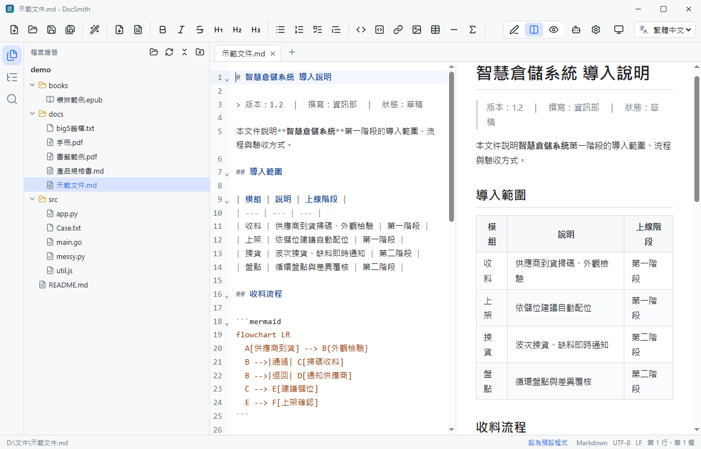

# DocSmith（文匠）

閱讀、撰寫、AI 協作的文件工作台：Markdown、文字檔、程式檔、PDF、電子書，單一執行檔、離線可用，介面可切換繁體中文 / English。



## 功能

- **Markdown 編輯與預覽**：即時排版、滾動同步、Mermaid 圖表、KaTeX 數學公式、程式碼高亮
- **多分頁與工作階段還原**：關掉再開，分頁、游標位置、閱讀進度都回來；當機也能還原未存檔內容
- **閱讀器**：PDF（縮圖、目錄、全文搜尋）與電子書 EPUB / MOBI / AZW3 / FB2 / CBZ（真正的分頁排版、字級行距、書籤）
- **文件轉換**：Word / Excel / PowerPoint / PDF / HTML / CSV 轉成 Markdown；Markdown 匯出成 PDF / Word
- **程式碼**：依副檔名上色，`Shift+Alt+F` 依文件類型自動排版（Prettier、gofmt、Ruff、clang-format、sql-formatter…）
- **側邊面板**：檔案總管、大綱、跨檔案搜尋（支援規則運算式）
- **AI 助手**：OpenAI / Gemini / DeepSeek / 自訂模型（公司內部閘道亦可），可針對開啟的分頁討論、潤稿、修正程式、產生說明文件；多組對話與對話紀錄、token 用量提示、思考模式設定
- **其他**：淺色 / 深色主題、檔案關聯、自動更新、繁體中文 / English 介面

## 安裝

下載 [`build/bin/DocSmith.exe`](build/bin/DocSmith.exe) 放到任意資料夾，雙擊即可使用，不需安裝、不需執行階段元件。

完整說明見 [操作手冊](docs/manual/操作手冊.md)（另有 [PDF](docs/manual/DocSmith%20操作手冊.pdf) 與 [Word](docs/manual/DocSmith%20操作手冊.docx) 版本）。

## 開發

需求：Go 1.23+、Node.js 20.19+、wails CLI（`go install github.com/wailsapp/wails/v2/cmd/wails@latest`）

```powershell
wails dev                  # 開發模式
.\publish.ps1 -Version 1.0.0   # 升版並產生 build\bin\DocSmith.exe
go test ./...              # Go 測試
```

產品名稱與 GitHub repo 集中在 `names.go` 與 `frontend/src/i18n.js` 的 `appName`。

## 隱私

設定、對話與備份都存在本機（`%APPDATA%\DocSmith\` 與專案的 `.DocSmith\`）。使用 AI 功能時，只有你勾選的分頁內容與問題會送到你自己設定的服務；API 金鑰以 Windows DPAPI 加密存放。公司可用登錄機碼 `HKLM\SOFTWARE\Policies\DocSmith` 停用 AI 或限制可用的服務。
