# DocSmith 操作手冊

> 適用版本：v1.0 以上　｜　適用系統：Windows 10 / 11　｜　只有一個執行檔，不需安裝

DocSmith（文匠）是一套**文件工作台**：寫 Markdown、讀 PDF、讀電子書、看程式碼，還能把 Word / Excel / PowerPoint / PDF 轉成 Markdown，或把 Markdown 匯出成 PDF、Word；右側的 AI 助手可以針對你開啟的任何檔案討論、潤稿、修程式、產生說明文件。


## 目錄

1. [安裝與第一次啟動](#1-安裝與第一次啟動)
2. [畫面介紹](#2-畫面介紹)
3. [工具列按鈕](#3-工具列按鈕)
4. [開啟與儲存檔案](#4-開啟與儲存檔案)
5. [分頁與工作階段還原](#5-分頁與工作階段還原)
6. [側邊面板：檔案總管、大綱、搜尋](#6-側邊面板檔案總管大綱搜尋)
7. [撰寫 Markdown](#7-撰寫-markdown)
8. [圖表與數學公式](#8-圖表與數學公式)
9. [程式碼與純文字檔](#9-程式碼與純文字檔)
10. [自動排版](#10-自動排版)
11. [PDF 閱讀器](#11-pdf-閱讀器)
12. [電子書閱讀器](#12-電子書閱讀器)
13. [把其他文件轉成 Markdown](#13-把其他文件轉成-markdown)
14. [匯出 PDF / Word](#14-匯出-pdf--word)
15. [AI 助手](#15-ai-助手)
16. [外觀與介面語言](#16-外觀與介面語言)
17. [設為預設程式](#17-設為預設程式)
18. [自動更新](#18-自動更新)
19. [快捷鍵一覽](#19-快捷鍵一覽)
20. [常見問題](#20-常見問題)

---

## 1. 安裝與第一次啟動

DocSmith **不需要安裝**，整個程式就是一個檔案 `DocSmith.exe`。

1. 把 `DocSmith.exe` 複製到固定的資料夾（例如 `D:\Tools\`）。
2. 雙擊啟動。第一次啟動會問要不要把它設為 `.md` 檔的預設開啟程式：

   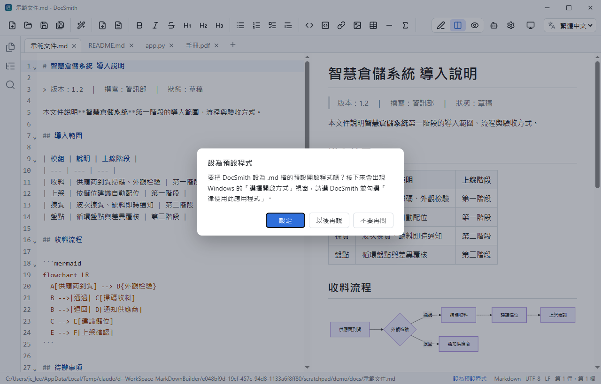

   - **設定**：接著出現 Windows 的「選擇開啟方式」視窗，選 **DocSmith** 並勾選「一律使用此應用程式」。
   - **以後再說**：下次啟動再問。
   - **不要再問**：不再詢問，之後仍可從狀態列的「設為預設程式」設定。

程式的設定與暫存都放在 `%APPDATA%\DocSmith\`（設定、工作階段、未存檔備份、AI 設定），不會寫到系統其他地方。

## 2. 畫面介紹

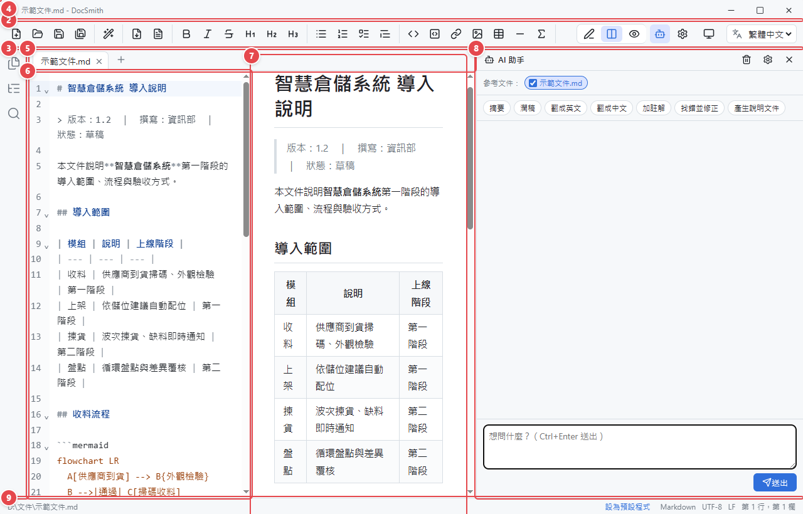

| 區塊 | 說明 |
| --- | --- |
| **標題列** | 程式自繪的標題列，顏色跟著淺色 / 深色主題走；右側是最小化、最大化、關閉 |
| **工具列** | 依用途分組：檔案、編輯格式、插入、匯出 / 轉換、排版、檢視、AI、設定、語言 |
| **活動列**（最左一豎） | 切換側邊面板：檔案總管、大綱、搜尋 |
| **側邊面板** | 檔案總管 / 大綱 / 搜尋，寬度可拖曳，會記住 |
| **分頁列** | 每份開啟的檔案一個分頁，`+` 可新增空白分頁 |
| **編輯區 / 預覽區** | 左邊寫 Markdown，右邊即時排版；中間分隔線可拖曳 |
| **閱讀區** | 開啟 PDF 或電子書時，取代編輯區的唯讀閱讀器 |
| **AI 面板**（右側） | 平常隱藏，按工具列的 AI 按鈕或 `Ctrl+Shift+A` 才滑出 |
| **狀態列** | 檔案路徑、文件類型、編碼、換行、游標位置；PDF / 電子書會顯示頁數或閱讀進度。右側的 **v1.0.0** 是目前版本，點一下可看「關於」並手動檢查更新 |

## 3. 工具列按鈕

| 群組 | 按鈕 |
| --- | --- |
| 檔案 | 新增分頁 `Ctrl+N`、開啟 `Ctrl+O`、儲存 `Ctrl+S`、另存新檔 `Ctrl+Shift+S` |
| 匯出 / 轉換 | 匯出 PDF、匯出 Word、轉為 Markdown（開啟 PDF / HTML / CSV 時才出現） |
| 編輯格式 | 粗體 `Ctrl+B`、斜體 `Ctrl+I`、刪除線 `Ctrl+Shift+X`、標題 1~3 `Ctrl+1~3` |
| 插入 | 項目 / 編號 / 任務清單、引用、行內程式碼 `Ctrl+E`、程式碼區塊 `Ctrl+Shift+E`、連結 `Ctrl+K`、圖片、表格、分隔線、數學公式 |
| 排版 | 自動排版 `Shift+Alt+F` |
| 檢視 | 只編輯、分割、只預覽 |
| 其他 | AI 助手 `Ctrl+Shift+A`、AI 設定、主題切換、介面語言 |

沒有意義的按鈕會自動收起來——例如讀 PDF 時不會出現 Markdown 的格式按鈕。

## 4. 開啟與儲存檔案

開啟方式有四種：工具列的「開啟」、`Ctrl+O`、把檔案**拖進視窗**、或從左邊的檔案總管點兩下。

支援的檔案：

| 類型 | 副檔名 | 開啟後 |
| --- | --- | --- |
| Markdown | `.md` `.markdown` `.mdown` `.mkd` | 編輯 + 即時預覽 |
| 文字 / 程式碼 | 任何文字檔（`.txt` `.py` `.go` `.js` `.ts` `.cs` `.java` `.sql` `.yaml` `.json` …） | 編輯器，依副檔名上色 |
| PDF | `.pdf` | PDF 閱讀器（可轉成 Markdown） |
| 電子書 | `.epub` `.mobi` `.azw` `.azw3` `.fb2` `.fbz` `.cbz` | 電子書閱讀器 |
| Office | `.docx` `.xlsx` `.xls` `.ods` `.pptx` | 自動轉成 Markdown，開成未存檔的新分頁 |
| 其他 | `.html` `.csv` | 可轉成 Markdown |

儲存時會**維持原本的編碼與換行**（UTF-8 / UTF-8 BOM / UTF-16 / Big5、CRLF / LF），狀態列看得到目前是哪一種。二進位檔會直接拒絕開啟，不會亂碼。

## 5. 分頁與工作階段還原

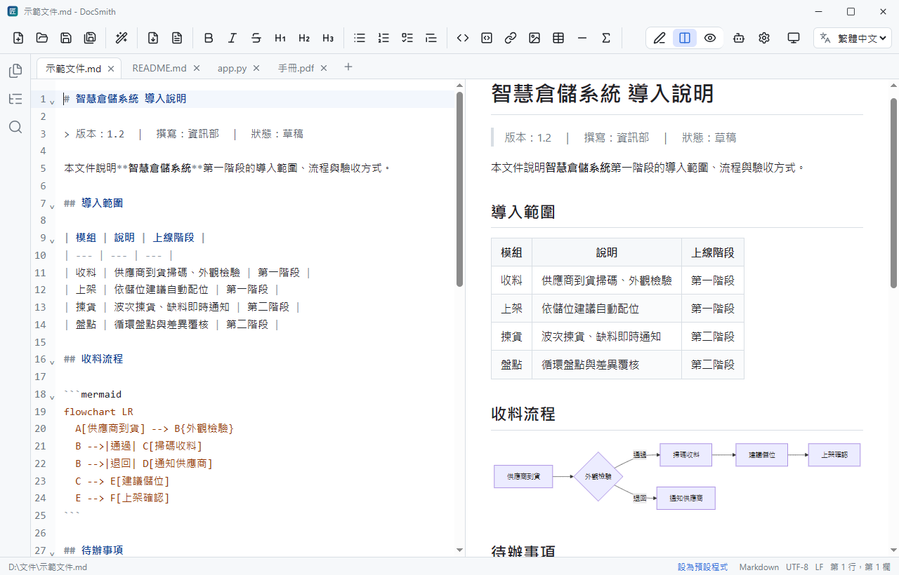

- `Ctrl+N` 新增、`Ctrl+W` 關閉、`Ctrl+Tab` 切換下一個分頁。
- 有未儲存變更的分頁，名稱旁會有一個點；關閉時會問要不要存。
- **關掉程式再開，上次開的分頁會自動回來**（包含游標位置、檢視模式、PDF 頁數與電子書進度）。
- 如果程式被強制關閉，下次啟動會問要不要還原未存檔的內容：

  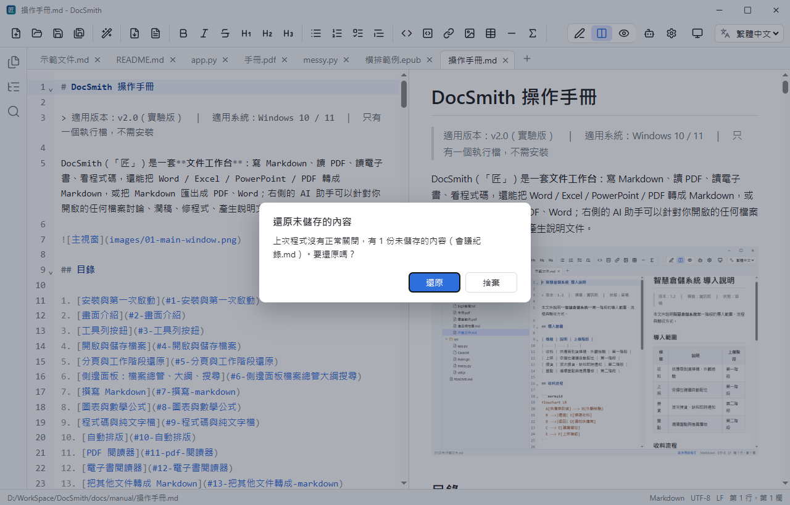

## 6. 側邊面板：檔案總管、大綱、搜尋

最左邊的活動列有三個按鈕：

**檔案總管**：開啟一個資料夾後，可以直接在裡面瀏覽、點兩下開檔。資料夾也會記住，下次啟動還在。

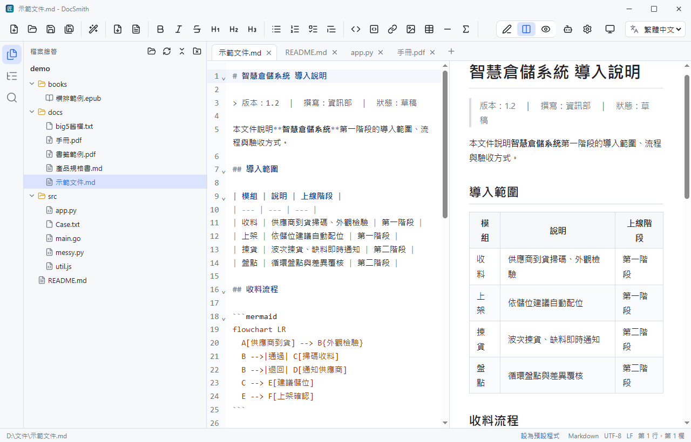

**大綱**：列出目前 Markdown 文件的標題層級，點一下跳到該段；PDF 和電子書則顯示書本目錄。

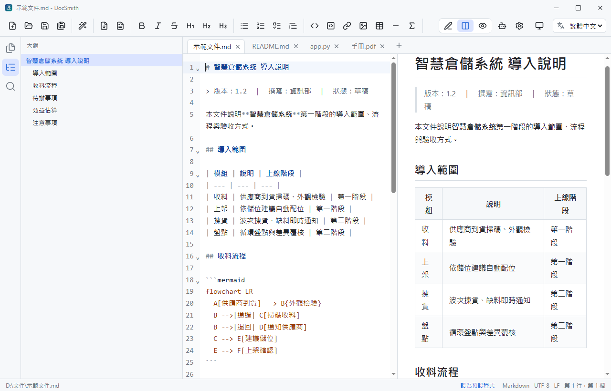

**搜尋** `Ctrl+Shift+F`：搜尋所有開啟的分頁，開了資料夾就連資料夾裡的檔案一起搜。可切換「區分大小寫」「全字比對」「規則運算式」，點結果直接跳到那一行。

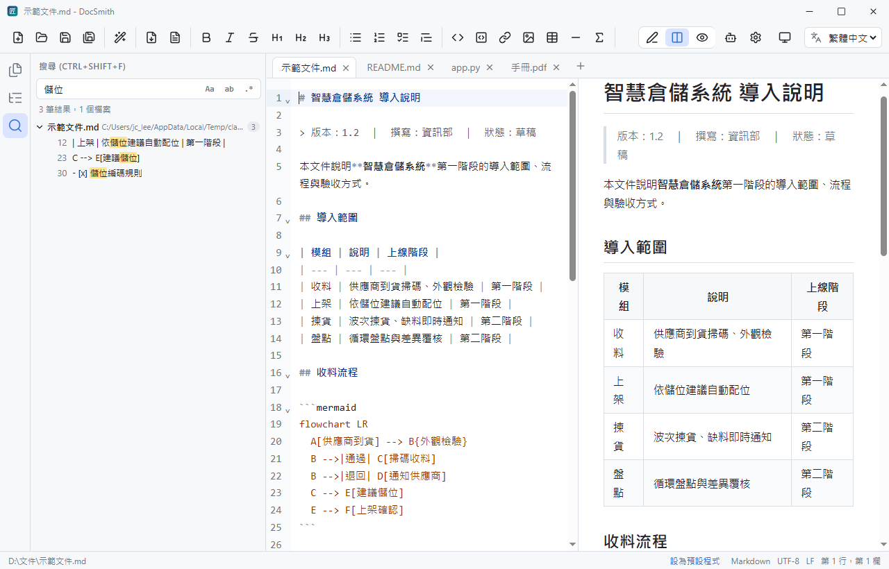

## 7. 撰寫 Markdown

左邊寫、右邊即時看結果。編輯器支援語法上色、自動縮排、清單自動延續、括號配對；預覽支援表格、任務清單、程式碼高亮、刪除線。

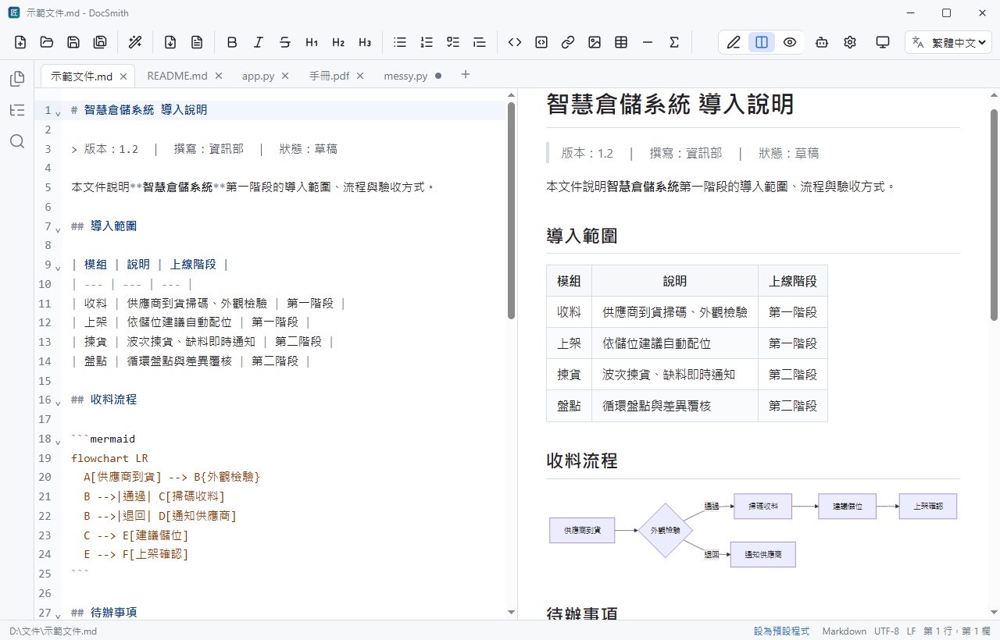

小技巧：

- 選取文字後按 `Ctrl+B` / `Ctrl+I` / `Ctrl+K`，會**包住選取範圍**而不是取代它。
- 「表格」按鈕會插入一個 3 欄的表格骨架，直接改欄位名稱就好。
- 預覽區會跟著編輯區滾動（滾動同步）。

## 8. 圖表與數學公式

**Mermaid 圖表**：用 ` ```mermaid ` 包起來，預覽區就會畫出圖。圖表顏色會跟著主題走。

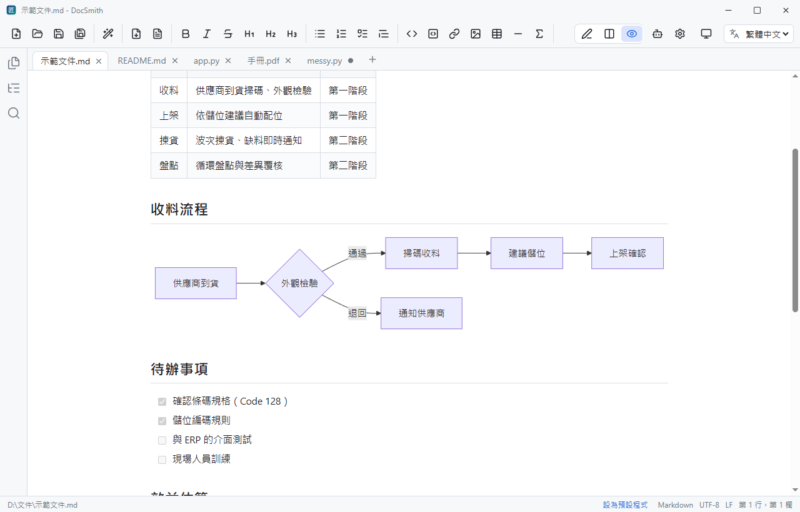

````markdown
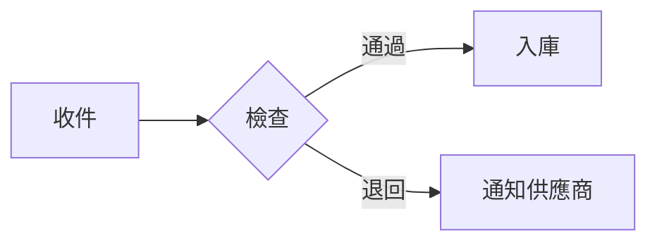
```mermaid
flowchart LR
  A[收件] --> B{檢查}
  B -->|通過| C[入庫]
  B -->|退回| D[通知供應商]
```
````

**數學公式**：行內用 `$...$`，獨立一行用 `$$...$$`（KaTeX）。

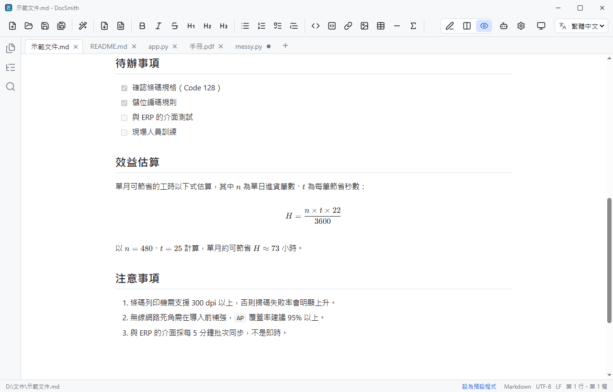

```markdown
質能等價：$E = mc^2$

$$
\int_{0}^{\infty} e^{-x^2}\,dx = \frac{\sqrt{\pi}}{2}
$$
```

匯出 PDF / Word 時，圖表與公式都會一起帶過去。

## 9. 程式碼與純文字檔

開啟程式碼檔會用單欄編輯器（沒有預覽），依副檔名上色，狀態列顯示語言。支援常見的語言：Python、Go、JavaScript / TypeScript、C / C++ / C#、Java、Rust、SQL、YAML、JSON、XML、Shell、PowerShell、Dockerfile 等。

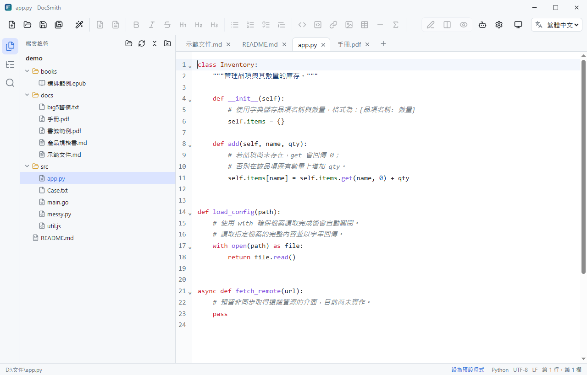

配合右側的 AI 助手，可以直接請它加註解、找錯、或產生這份程式的說明文件（見 [第 15 節](#15-ai-助手)）。

## 10. 自動排版

按 `Shift+Alt+F` 或工具列的排版按鈕，DocSmith 會**依文件類型挑對應的排版工具**：

| 文件類型 | 使用的工具 |
| --- | --- |
| Markdown | Prettier ＋ 中英文之間自動補空格 |
| JavaScript / TypeScript / JSX / CSS / SCSS / HTML / YAML / GraphQL | Prettier |
| JSON | 標準 2 空格縮排 |
| Python | Ruff |
| Go | gofmt |
| C / C++ / C# / Java | clang-format |
| SQL | sql-formatter |
| XML | xml-formatter |
| 純文字 | 去掉行尾空白、統一空行 |

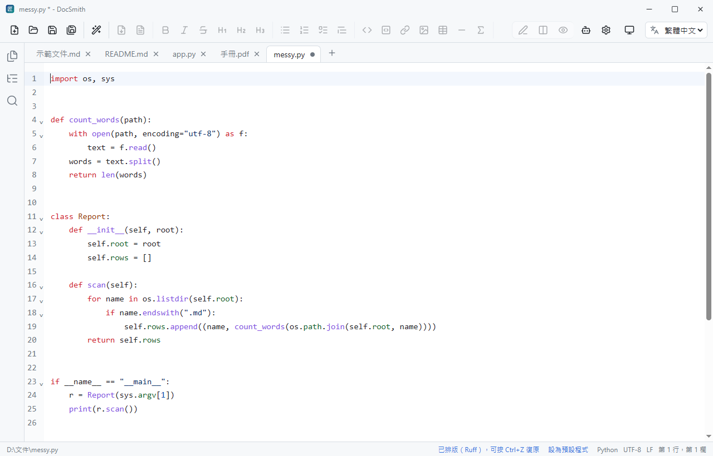

排版後狀態列會顯示用了哪個工具，而且**可以按 `Ctrl+Z` 復原**。不支援的類型會直接告訴你，不會亂改內容。

## 11. PDF 閱讀器

開啟 `.pdf` 會進入閱讀器：連續捲動、縮圖側欄、書籤目錄、文字選取與複製、全文搜尋。

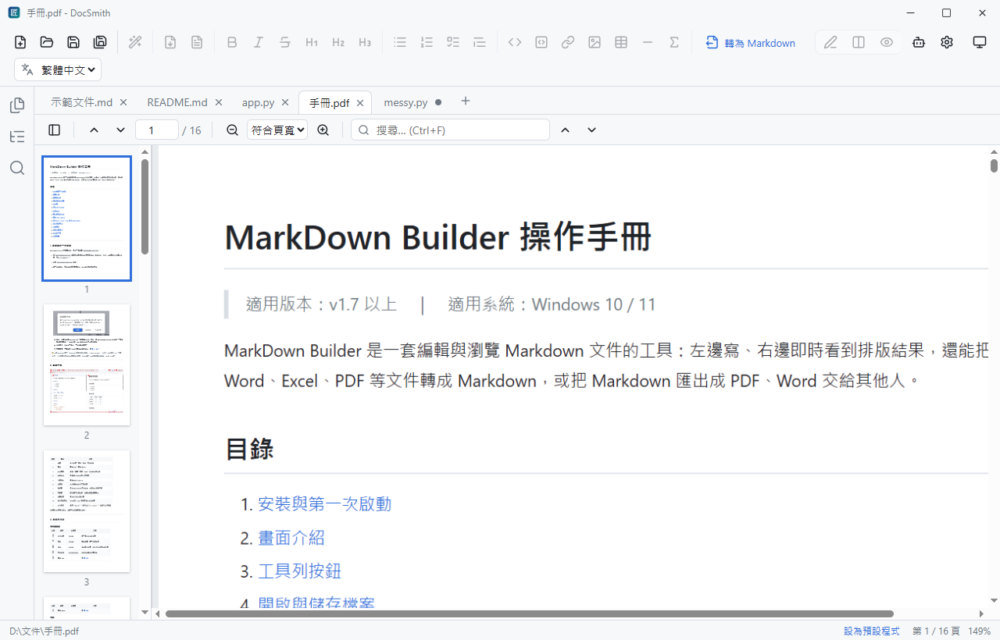

| 操作 | 方式 |
| --- | --- |
| 翻頁 | 滑鼠滾輪、上 / 下一頁按鈕、直接輸入頁碼 |
| 縮放 | `Ctrl++` / `Ctrl+-`，或選「自動」「符合頁寬」「整頁」 |
| 搜尋 | `Ctrl+F`，`Enter` 下一個、`Shift+Enter` 上一個 |
| 目錄 | 左側「大綱」面板顯示 PDF 書籤，點一下跳頁 |
| 縮圖 | 工具列的縮圖按鈕 |

**轉成 Markdown**：工具列的「轉為 Markdown」會把 PDF 的文字抽出來、整理成段落，開成一個新的 Markdown 分頁（原始 PDF 分頁不動）。

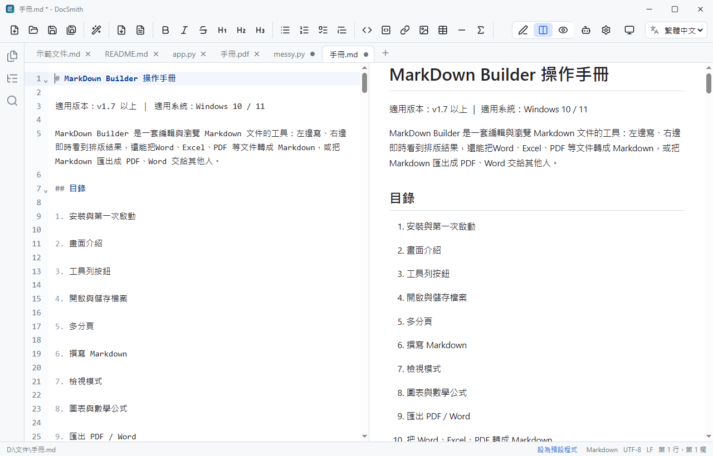

> 掃描件（純圖片的 PDF）沒有文字可抽，轉出來會是空的——這種情況需要 OCR，DocSmith 不做。

## 12. 電子書閱讀器

支援 EPUB、MOBI、AZW / AZW3、FB2、CBZ（漫畫）。這是**真正的電子書排版**：分欄分頁、書本自己的字型與樣式、直排書也正常。

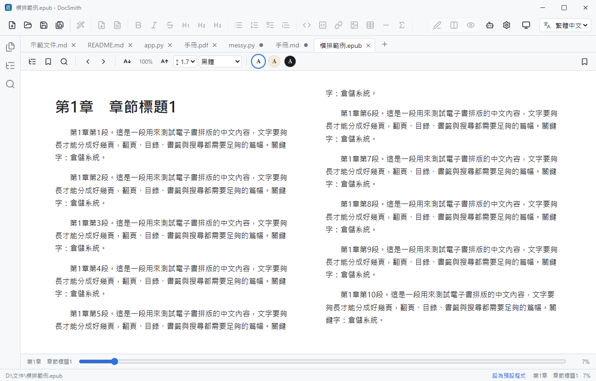

| 操作 | 方式 |
| --- | --- |
| 翻頁 | 左右方向鍵、上下方向鍵、`PageUp` / `PageDown`、滑鼠滾輪 |
| 目錄 | 工具列「目錄」，或左側大綱面板 |
| 字級 / 行距 / 字型 | 工具列的排版設定：`Ctrl++` / `Ctrl+-`、行距、明體 / 黑體 / 書本原字型 |
| 閱讀主題 | 白色、米色、深色 |
| 書籤 | 工具列書籤按鈕加入目前位置，書籤清單可跳回 |
| 全書搜尋 | `Ctrl+F` |


**閱讀位置、書籤、排版設定都會記住**：同一本書下次打開就回到上次讀到的地方。有 DRM 保護的電子書無法開啟（會明確告知）。

## 13. 把其他文件轉成 Markdown

把 Word、Excel、PowerPoint、PDF、HTML、CSV 拖進視窗（或用「開啟」），DocSmith 會轉成 Markdown 並開成**未存檔的新分頁**，確認內容沒問題再存檔。

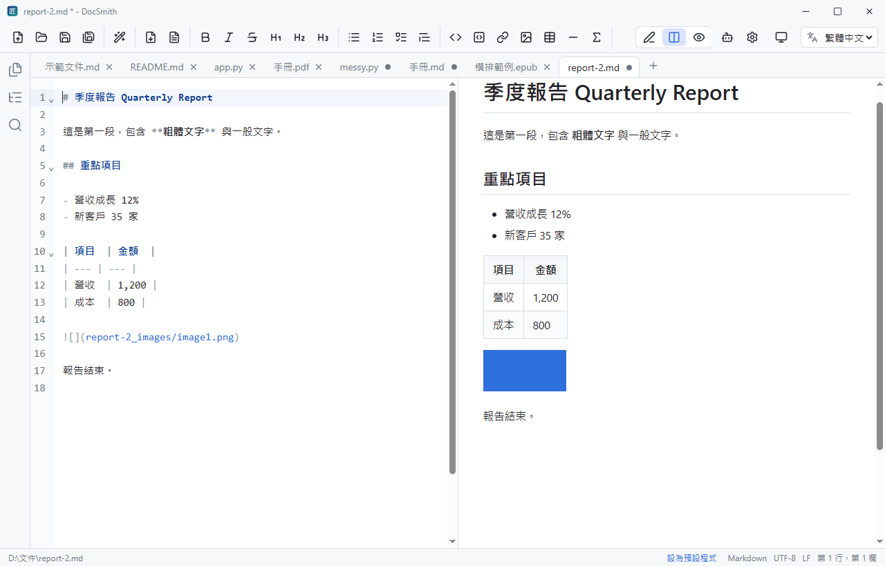

| 來源 | 轉換結果 |
| --- | --- |
| Word `.docx` | 標題、清單、粗體斜體、表格、連結、圖片 |
| Excel `.xlsx` `.xls` `.ods` | 每張工作表一個 `##` 段落 + Markdown 表格 |
| PowerPoint `.pptx` | 每張投影片一個 `## 投影片 N` + 文字內容 |
| PDF | 文字抽取、段落合併 |
| HTML | 轉成對應的 Markdown 語法 |
| CSV | Markdown 表格 |

舊版二進位格式（`.doc` `.ppt` `.rtf` `.odt` `.odp`）不支援，程式會提示你先用 Office 另存成新格式。

## 14. 匯出 PDF / Word

工具列的「匯出 PDF」「匯出 Word」會把**預覽區看到的樣子**輸出成檔案。

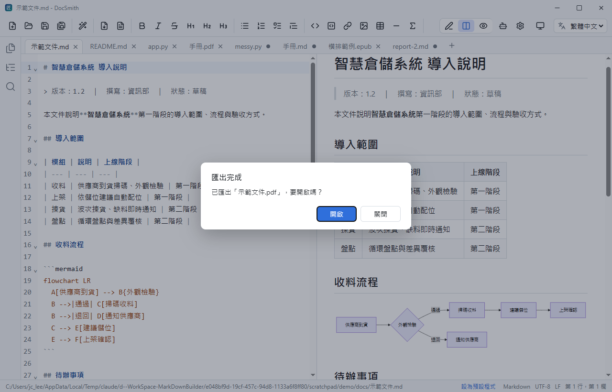

- **PDF**：用系統的 Microsoft Edge 排版輸出，含可點的目錄書籤；Mermaid 圖與數學公式都會保留。
- **Word**：輸出 `.docx`，標題對應 Word 的樣式，圖表與公式以圖片嵌入。

匯出完成會問要不要立刻打開檔案。

## 15. AI 助手

### 15.1 設定模型

第一次使用要先設定服務。按工具列的齒輪（AI 設定），或 AI 面板標題列的齒輪：

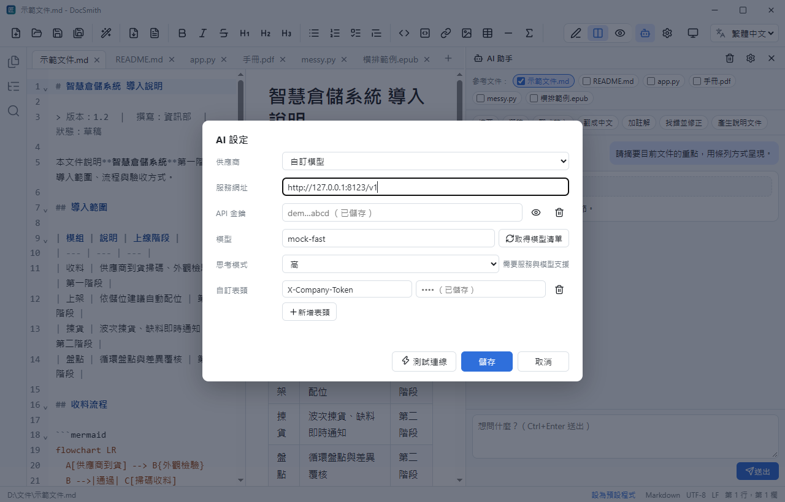

1. **供應商**：OpenAI、Gemini、DeepSeek、或**自訂模型**（公司內部模型、Azure OpenAI、本機 Ollama / vLLM 等 OpenAI 相容服務）。
2. **服務網址**：選內建供應商會自動帶入；自訂模型請填 base URL（例如 `https://ai.company.com/v1`），程式會自己接 `/models`、`/chat/completions`。
3. **API 金鑰**：貼上金鑰。金鑰用 Windows DPAPI 加密後存放，只有這台電腦的這個使用者解得開，介面上只會顯示「（已儲存）」。
4. **自訂表頭**（自訂模型才有）：公司閘道若要求 `api-key`、`X-Api-Key`、`Authorization: xxx` 之類的表頭，在這裡一列一列加。
5. **取得模型清單**：向服務要可用模型並列出來；服務沒有提供清單時，可直接輸入模型名稱。
6. **思考模式**：`預設（不指定）` / `關閉` / `低` / `中` / `高` / `極高` / `最高`，每個供應商各自記住。
7. **測試連線**：會顯示延遲與可用模型數量，或明確的錯誤原因（金鑰無效、路徑不對、連不上、次數超限）。

#### 關於思考模式

推理模型可以指定要「想多久」：想得少→快又省，想得多→答得準。DocSmith 會依供應商送出對應的參數：

| 供應商 | 關閉 | 低 / 中 / 高 / 極高 / 最高 |
| --- | --- | --- |
| OpenAI、Gemini、自訂模型 | `reasoning_effort: none` | `reasoning_effort: low / medium / high / xhigh / max` |
| DeepSeek | `thinking: { type: "disabled" }` | `thinking: { type: "enabled" }`，並以 `reasoning_effort` 指定 `low / high / max` |

- 預設值是「預設（不指定）」，此時請求**完全不帶思考參數**，公司自架或較舊的服務不會因此出錯。
- 不是每個模型都支援每個等級（例如某些模型沒有「極高」）。服務會回報錯誤訊息，改回「預設」或換一個等級即可。
- 公司的 AI 閘道（例如 Open WebUI、LiteLLM 這類）通常會把 `reasoning_effort` 轉成各家模型自己的思考預算，所以自訂模型也適用。
- 模型回傳思考內容時，面板上會多一個「**思考過程**」區塊：還沒開始回答時自動展開，答案出現後收合，想看再點開。

### 15.2 對話

按工具列的 AI 按鈕或 `Ctrl+Shift+A`，面板從**右側**滑出，寬度可拖曳、狀態會記住。

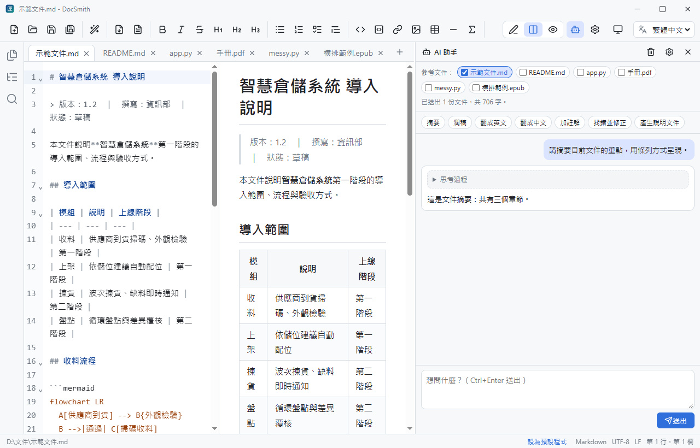

- 在下方輸入問題，`Ctrl+Enter` 或按「送出」；回覆會**逐字出現**，中途可按「停止」。
- **參考文件**：面板上方列出所有開啟的分頁，勾選哪幾份，AI 就看哪幾份（預設是目前這一份）。送出後會顯示「已送出 N 份文件，共 X 字」，可以確認內容真的帶出去了。PDF 會自動抽文字；電子書無法作為參考內容、空白分頁沒有內容，都會註明略過；內容太長會截斷並告知。
- 對話內容會保存，關掉程式再開還在；按垃圾桶圖示可清除目前這一組。

### 15.3 多組對話與對話紀錄

面板標題列有「**新對話**」與「**對話紀錄**」兩個按鈕。

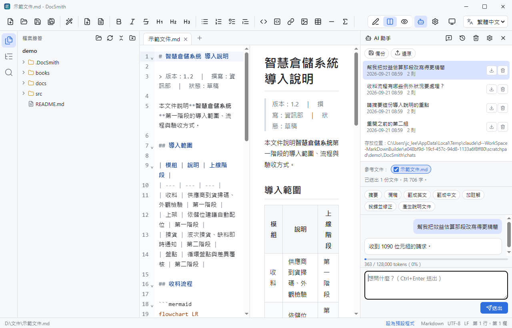

- **新對話**：把目前這組收起來、開一組乾淨的。換主題時就該按，因為每次送出都會帶最近幾則歷史，對話越長越花 token。
- **對話紀錄**：列出這個資料夾的所有對話（標題取第一句問題、最後更新時間、則數）。點一下切換回去，每列還可以**匯出**成 Markdown 或**刪除**。
- 上方兩個按鈕是「**備份**」（把整個資料夾的對話存成一個 JSON）與「**還原**」（從備份 JSON 匯入）。

**存放位置**：有開啟資料夾時放在該資料夾的 `.DocSmith\chats\`，所以**每個專案有自己的對話紀錄**，換資料夾就換一批；沒開資料夾時放在 `%APPDATA%\DocSmith\chats\`。清單最下面會顯示目前的實際位置。

- 對話檔經過壓縮並以 Windows 帳號加密，複製到別台電腦或別的帳號都打不開
- 同時會在 `%APPDATA%\DocSmith\chats-backup\` 留一份**未加密的備援**，萬一加密檔讀不到（換帳號、檔案損毀）會自動改讀備援，資料不會不見
- `.DocSmith\` 裡會自動放一個內容為 `*` 的 `.gitignore`，不會被 git 收進專案
- 每個資料夾保留最近 100 組，每組最多 60 則訊息

> 想長期保存或給別人看，用「匯出」或「備份」—— 這兩個動作產生的是**明文**檔案，換電腦也讀得到。

### 15.4 Token 用量

輸入框上方有一條用量長條：

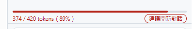

- 顯示的是**下一次送出的量**：系統提示 ＋ 勾選的參考文件 ＋ 對話歷史 ＋ 輸入框裡的字。打字、勾文件、切換對話都會立刻變動。
- 服務有回報實際用量時就顯示實際數字；沒有回報時顯示估算值，前面會加「約」。
- **超過 60% 轉黃、超過 80% 轉紅**，並出現「建議開新對話」按鈕，點了就等於按「新對話」。
- 分母（對話長度上限）依模型名稱自動判斷（例如 gpt-5 系列 400K、Claude 200K、Gemini 1M），判斷不出來用 128K；要自己指定就到 AI 設定的「對話長度上限」填，留空＝自動。

### 15.5 常用動作

面板上的一排按鈕，點一下就送出對應的要求：

| 按鈕 | 作用 |
| --- | --- |
| 摘要 | 摘要目前文件的重點 |
| 潤稿 | 潤飾文字，保持原意與 Markdown 結構 |
| 翻成英文 / 翻成中文 | 翻譯整份文件 |
| 加註解 | 為程式碼加上註解，不改變行為 |
| 找錯並修正 | 找出錯誤並給修正後的完整內容 |
| 產生說明文件 | 分析程式碼，產生一份 Markdown 說明文件 |

### 15.6 把結果用到文件上

回覆裡的每個程式碼區塊上方都有四個按鈕：**插入游標處**、**取代選取範圍**、**開成新分頁**、**複製**。

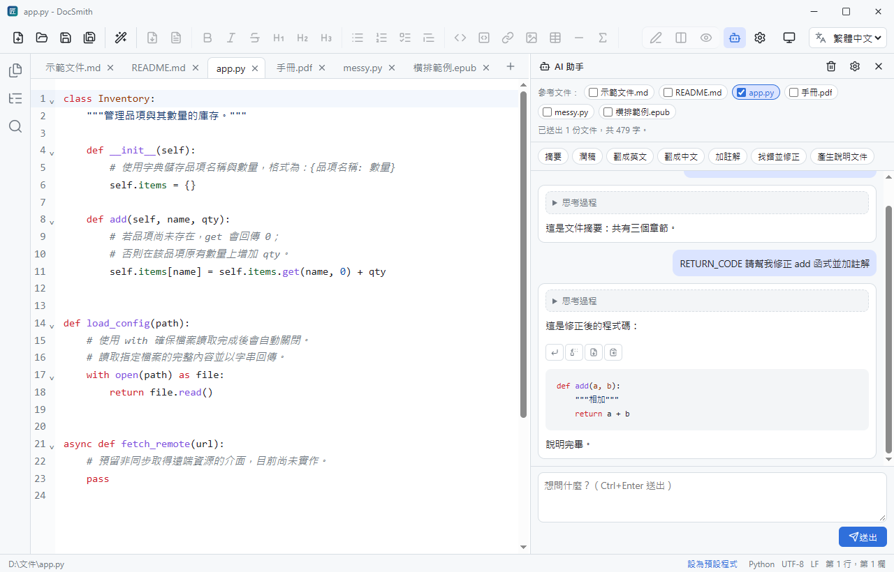

整份改寫（潤稿 / 修正 / 加註解）的回覆下方會有「**套用到文件**」。按下去會先顯示**差異比較**——哪幾行新增、哪幾行刪除——確認後才改，而且改完可以 `Ctrl+Z` 復原。

> **套用前請看一眼差異。** 有些模型在「修正」時會順手把註解或整段內容刪掉。DocSmith 已經在指示裡要求模型保留原有的註解、空行與排版，並且在**套用後行數明顯變少**時，於差異比較上方顯示紅色提醒；但最後確認的還是你。

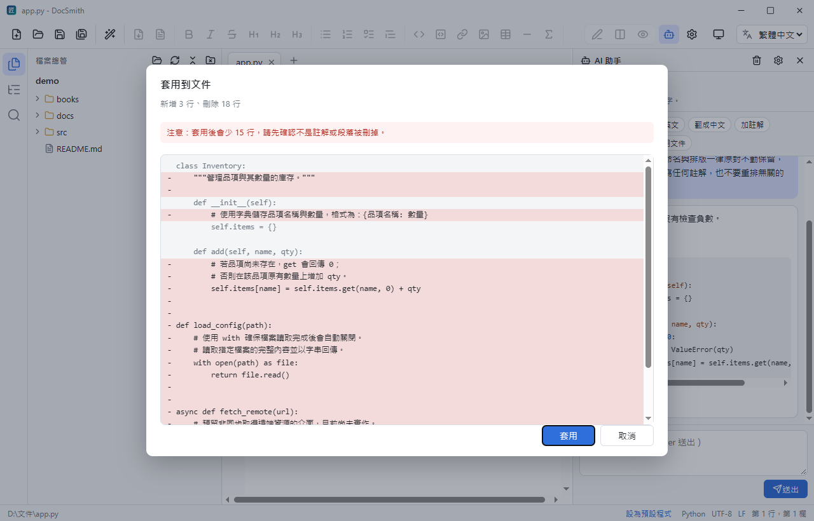

「產生說明文件」的結果則是「**開成新分頁**」，直接變成一份新的 Markdown 文件。

### 15.7 隱私與公司政策

- 使用 AI 功能時，**你勾選的文件內容與問題會傳送到你設定的服務**。第一次使用會出現提醒，同意後才開始；機密文件建議改用公司內部模型。
- 除了你勾選的內容與對話，DocSmith 不會傳送其他東西；對話與設定只存在本機。
- 公司可用登錄機碼統一管理（`HKLM\SOFTWARE\Policies\DocSmith`，`HKCU` 亦可）：

  | 值 | 型別 | 作用 |
  | --- | --- | --- |
  | `DisableAI` | DWORD `1` | 完全停用 AI，按鈕與面板都不出現 |
  | `AllowedAIProviders` | 字串，例如 `custom` | 只允許指定的供應商 |
  | `CustomBaseURL` | 字串 | 鎖定服務網址，使用者不能改 |

## 16. 外觀與介面語言

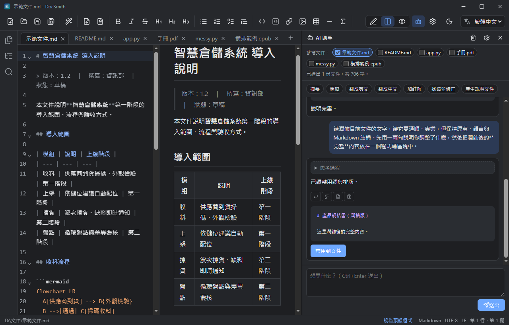

- 工具列的主題按鈕在「跟隨系統 → 淺色 → 深色」之間切換，**標題列與圖表顏色都會跟著變**。
- 右上角的語言選單可切換**繁體中文 / English**，整個介面（包含 AI 助手與它給模型的指示）都會跟著換。

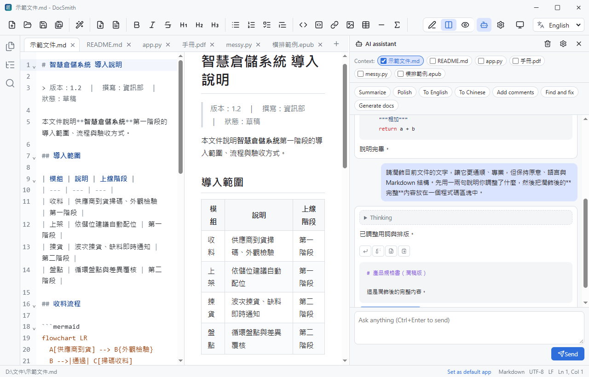

## 17. 設為預設程式

狀態列的「設為預設程式」可以隨時把 DocSmith 設成 `.md` 檔的預設開啟程式；程式也會在 `HKCU\Software\Classes` 註冊自己支援的副檔名，因此在檔案總管對檔案按右鍵 →「開啟方式」就能選到 DocSmith。

不需要管理員權限，也不會動到其他使用者的設定。

## 18. 自動更新

狀態列右側會顯示目前版本（例如 `v1.0.0`），點一下打開「關於」，裡面可以**手動檢查更新**或開啟專案頁面。

DocSmith 啟動時也會自動到 GitHub 看看有沒有新版本：

- 有新版時，**右下角**會出現提示，寫明版本號與更新內容，你決定要不要更新
- 按「立即更新」後會自動下載、驗證檔案（SHA-256），然後重新啟動成新版本；你開著的分頁會照常還原
- **沒有網路時完全不會出現任何提示**，也不會拖慢啟動
- 不想更新就按「稍後」，下次啟動再問

更新檔只會從本專案的 GitHub 位置下載，下載後會比對雜湊值，不符就不會安裝。

## 19. 快捷鍵一覽

| 分類 | 快捷鍵 | 作用 |
| --- | --- | --- |
| 檔案 | `Ctrl+N` / `Ctrl+O` / `Ctrl+S` / `Ctrl+Shift+S` | 新增分頁 / 開啟 / 儲存 / 另存新檔 |
| 分頁 | `Ctrl+W` / `Ctrl+Tab` | 關閉 / 切換下一個 |
| 編輯 | `Ctrl+B` `Ctrl+I` `Ctrl+Shift+X` | 粗體 / 斜體 / 刪除線 |
| 編輯 | `Ctrl+1` `Ctrl+2` `Ctrl+3` | 標題 1 / 2 / 3 |
| 編輯 | `Ctrl+E` / `Ctrl+Shift+E` / `Ctrl+K` | 行內程式碼 / 程式碼區塊 / 連結 |
| 排版 | `Shift+Alt+F` | 自動排版 |
| 面板 | `Ctrl+Shift+F` / `Ctrl+Shift+A` | 搜尋 / AI 助手 |
| 閱讀 | `Ctrl+F` / `Ctrl++` / `Ctrl+-` | 搜尋 / 放大 / 縮小 |
| 閱讀 | 方向鍵、`PageUp` `PageDown` | 翻頁 |
| 通用 | `Ctrl+Z` / `Ctrl+Y` | 復原 / 重做 |

## 20. 常見問題

**Q：開啟很大的檔案會卡住嗎？**
A：文字檔與 Markdown 沒有特別限制；PDF 與電子書是逐頁 / 逐章載入，開大檔也不會一次吃掉記憶體。

**Q：匯出 PDF 失敗？**
A：PDF 輸出需要系統裡有 Microsoft Edge（Windows 10 / 11 內建）。若被公司政策停用 Edge，請改用「匯出 Word」。

**Q：AI 面板的按鈕不見了？**
A：公司政策 `DisableAI` 停用了 AI 功能（見 [15.7](#157-隱私與公司政策)）。

**Q：測試連線顯示「找不到這個服務路徑」？**
A：服務網址多半填錯層級。填到 `/v1` 就好（程式會自己接 `/models`、`/chat/completions`），不要把 `/chat/completions` 也填進去。

**Q：AI 回覆說看不到我的文件？**
A：檢查面板上方的「參考文件」有沒有勾選那一份；電子書分頁無法作為參考內容。

**Q：轉成 Markdown 的結果不完美？**
A：轉換是盡力而為（尤其是複雜表格與版面），結果會開成未存檔的分頁，請自己校對後再存。

**Q：更新會不會在我不知情的時候發生？**
A：不會。程式只會在有新版時於右下角提示，**按了「立即更新」才會下載安裝**；離線時完全不提示。
